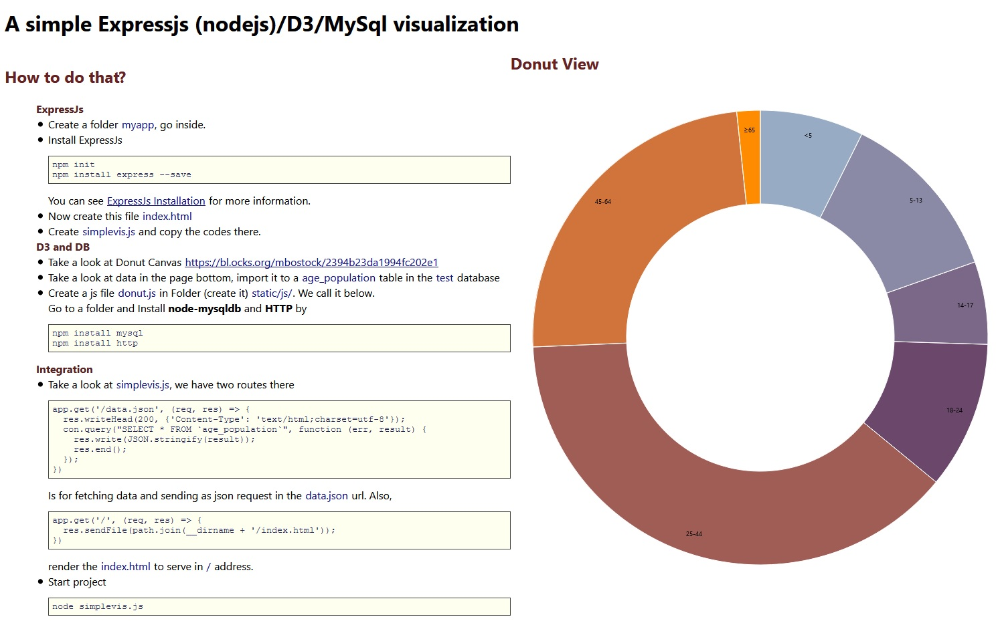

# A-simple-Expressjs-nodejs-D3-MySql-visualization
Creating a minimal simple visualization by the nodejs framework ExpressJs and D3.js Library using MySql Database. It uses a pool connection

## How to do that?
---
**ExpressJs**
* Create a folder `myapp`, go in there.
* Install ExpressJs
	npm init
	npm install express --save
* You can see [ExpressJs Installation](http://expressjs.com/en/starter/installing.html) for more information.
* Create this file  `index.html`
*Create  `simplevis.js` and copy the codes there.
---
**D3 and DB**
* Take a look at Donut Canvas [https://bl.ocks.org/mbostock/2394b23da1994fc202e1](https://bl.ocks.org/mbostock/2394b23da1994fc202e1)
* Take a look at data in the page bottom, import it to a  `age_population` table in the `test` database
* Create a js file `donut.js` in Folder (create it) `static/js/`. We call it below.
* Go to a folder and Install `node-mysqldb` and `HTTP` by
	npm install mysql
	npm install http    
---
**Integration**
* Take a look at `simplevis.js`, we have two routes there
		app.get('/data.json', (req, res) => {
		  res.writeHead(200, {'Content-Type': 'text/html;charset=utf-8'});
		  con.query("SELECT * FROM `age_population`", function (err, result) {
		    res.write(JSON.stringify(result));
		    res.end();
		  });
		});
Is for fetching data and sending as json request in the `data.json` url.
Also,
		app.get('/', (req, res) => {
		  res.sendFile(path.join(__dirname + "/index.html"));
		})
render the `index.html` to serve in `/` address.
* Start project
	node simplevis.js
*Go to `http://127.0.0.1:3000/`. sAlso, you can check `http://127.0.0.1:3000/data.json` path for the json data.
    </ul>
  

